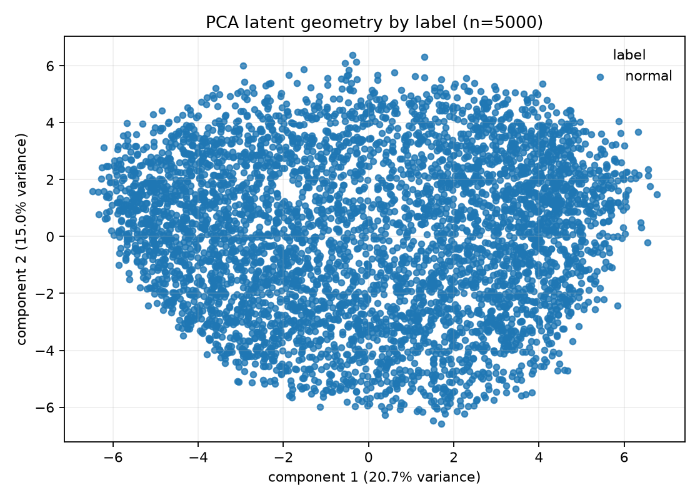
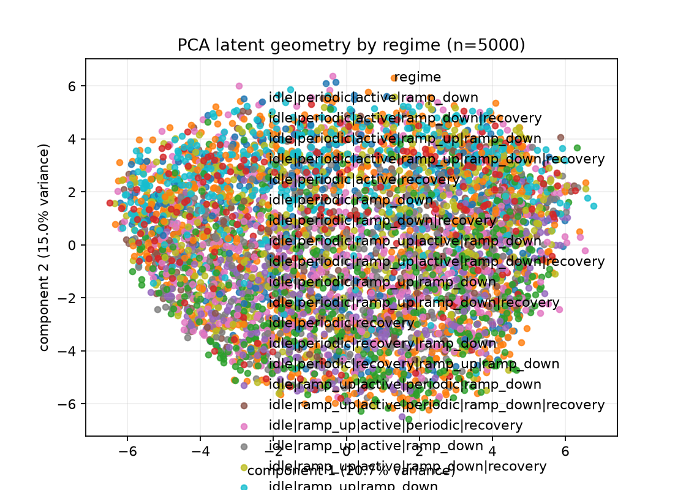
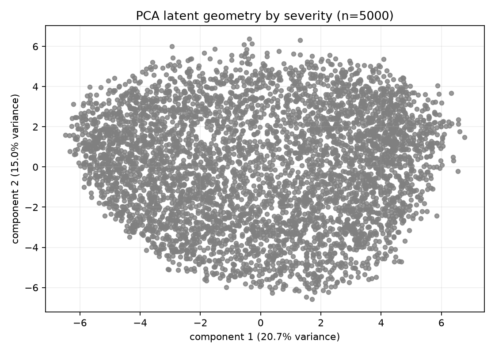
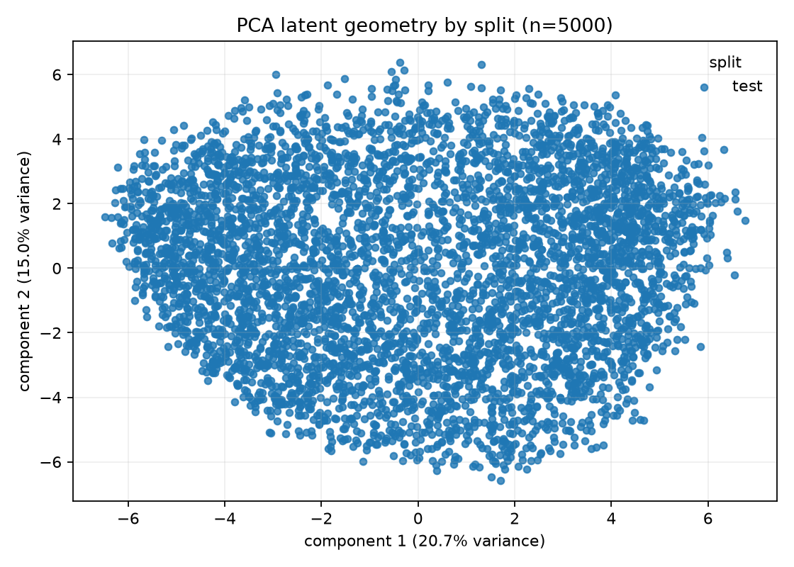
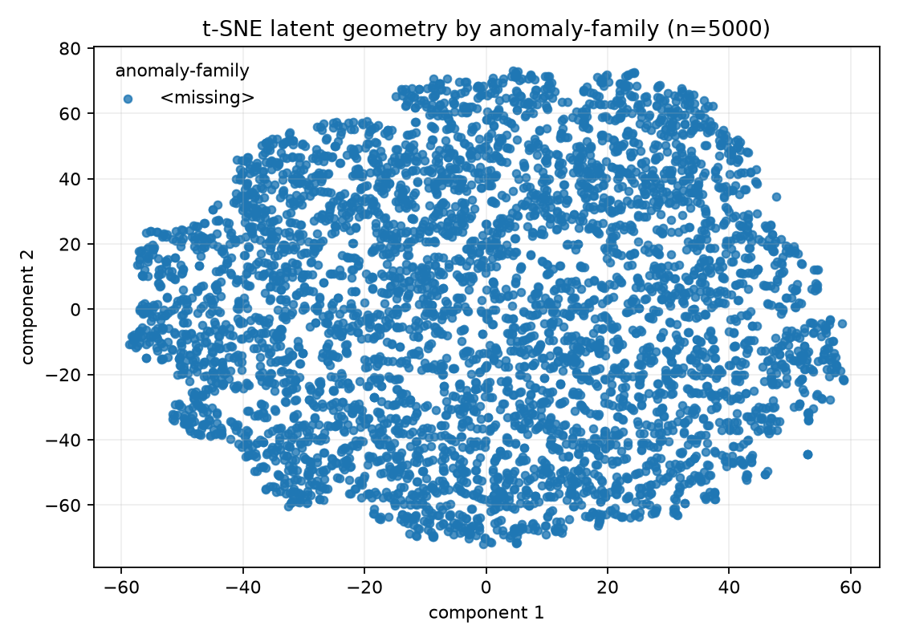
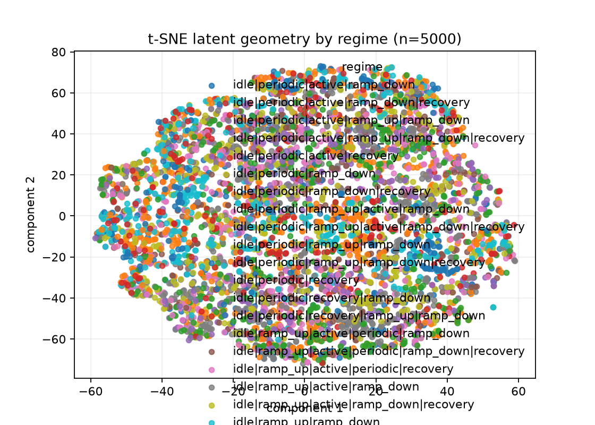
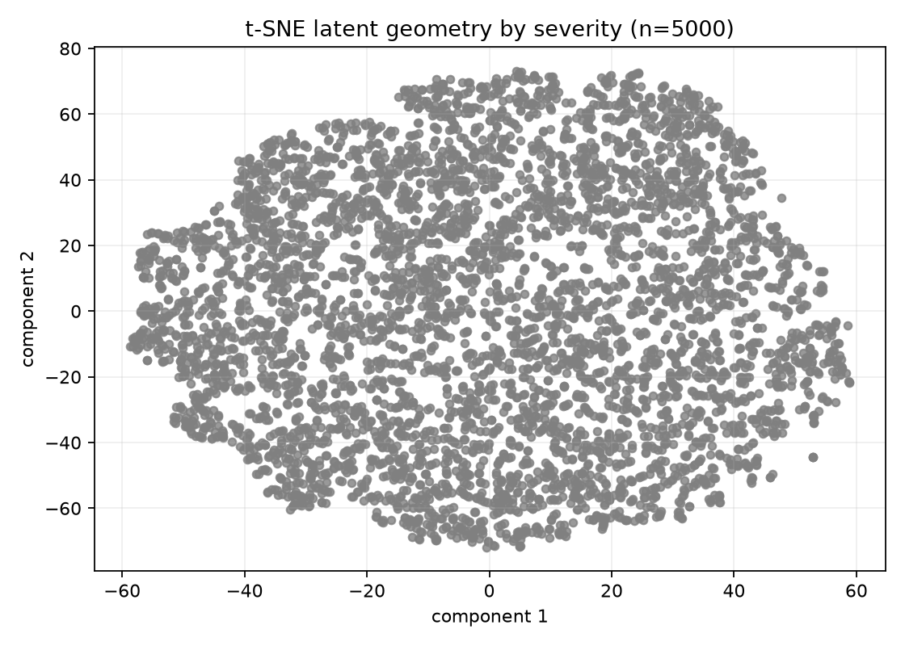
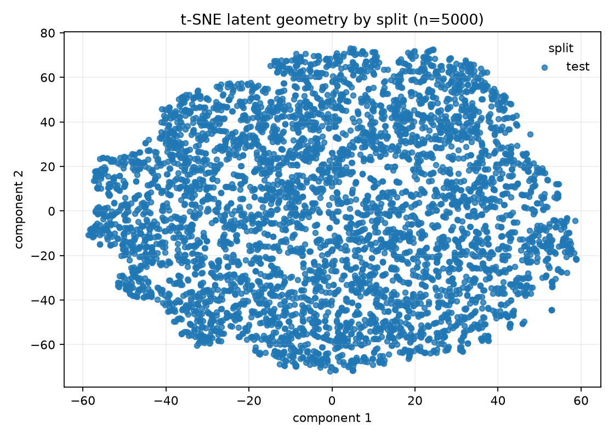

# V1 results — run `01` (all real executions)

Consolidated summary of every real V1 result: the training checkpoint, the executed Kaggle inference run, and the server geometry run. This folder was renamed from `experiments/20260905/server-geometry-run-1/`; Sprint 6 evidence files keep the historical path. No notebook was re-executed for this summary; every number below cites its exact artifact.

## Contents

- `geometry_extraction.ipynb` / `geometry_extraction.executed.ipynb` — Stage 1 notebook and its executed server run (exit 0).
- `geometry_analysis.ipynb` / `geometry_analysis.executed.ipynb` — Stage 2 notebook and its executed server run (exit 0).
- `infer-v1-representation.executed.ipynb` — executed Kaggle inference notebook (historical; see staleness verdict below).
- `extraction_stdout.log`, `analysis_stdout.log` — remote execution logs.
- `geometry-cache/` — extraction cache: `geometry-manifest.json`, `metrics.json` (large `embeddings.npz`/`records.csv`/`neighbors.csv` stay server-side).
- `geometry-analysis/` — `metrics.json` plus `assets/` figures (large `neighbors.csv`/diagnostics bundle stay server-side).
- `assets/` — all 12 geometry figures. The inference notebook produced no figures.

## 1. Training provenance (read from actual artifacts)

- Checkpoint `checkpoints/v1_representation_20260904_01.pt`, step **7840**, SHA-256 `7156f020…ee2809` (full hash in `geometry-cache/geometry-manifest.json`, `checkpoint.sha256`).
- Config (from the same manifest): 6 channels, patch 32 / stride 16, `d_model=128`, 4 sequence layers, 4 heads, dropout 0.1, EMA 0.996, `n_robots=5`/`n_programs=8` with conditional norm, `min_bucket_samples=32`, contrastive ramp 980+980 steps to `lambda_max=0.1` at τ=0.2, `knn_k=5`.
- Reference bank: 8192×128 fitted normal embeddings, k=5 (checkpoint payload); extraction used it capped to 5000 rows (`geometry-manifest.json` `checkpoint.reference_count: 5000`).
- Dataset: `data/generated/production`, manifest SHA-256 `bfcb86df…e1512f1`, `config_hash: ee1ac4ba7f66`, generator 2.0.0, splits train 100000 / val 20000 / test 100000 (all `complete`), 6 channels; legacy pre-fleet manifest (no `fleet` key → recorded `fleet_precheck: skipped`, per-batch range guards enforced).

## 2. Executed inference (Kaggle T4; STALE vs the server runs)

Source: `infer-v1-representation.executed.ipynb` (5/5 code cells executed, no errors, ~7.5 min wall). Full provenance in `artifacts/sprint-6/task-14.md`; results in `task-15.md`; cross-check in `task-16.md`.

- Data: medium Kaggle mount, train 25000 / val 5000 / test 20000, all loaded to RAM. Checkpoint: same step-7840 file via the Kaggle model mount (hash not recorded in outputs).
- Test 10000 normal + 10000 abnormal: TP 2299, FP 1934, FN 7701, TN 8066 → precision **0.543**, recall **0.230**, F1 **0.323**; AUROC `S_pred` **0.538**, `S_pop` **0.509** (near chance). Val-calibrated thresholds (×2.5 MAD): 0.0772 / 6.4668. Test score means: `S_pred` 0.0575, `S_pop` 5.7023.
- Per-family detection (of ~1111 each): duration_anomaly 426 (38.3%) best; others 217–264 (~20–24%). Timestep localization present but degenerate (near-zero traces).
- Caveats: `S_pop` here is distance to a **64-row refit bank** (the restored 8192-row bank is overwritten by design in the notebook — still true in canonical `notebooks/infer_v1_representation.ipynb`), **not** to the checkpoint bank. No random-weight fallback fired (checkpoint loaded).
- **Staleness verdict: STALE** — pre-Sprint-6 Kaggle code (mount discovery, no fail-fast gate), Tesla T4, medium dataset. A historical weak-separation result only; not comparable one-to-one with the server geometry run below.

## 3. Server geometry run (RTX 4060 Ti, CUDA, source commit `a326e48`)

- Extraction (`geometry_extraction.executed.ipynb`, exit 0, 12.4 s): 5000 head-sampled production `test` files (all normal), batch 32, seed 20260904 → valid cache (`geometry-cache/geometry-manifest.json`: `records_count` 5000, per-file bytes+SHA-256 linkage). Full run evidence in `artifacts/sprint-6/task-5.md` (+`task-12.md` rerun).
- Health (`geometry-analysis/metrics.json`): rank **127/128 (near-full, not full)**, effective rank 17.84, anisotropy 26.48, **not collapsed**, zero dead dims; embedding norm 9.28 ± 0.58; PCA variance 0.207 + 0.150.
- Within-cache reference distance: mean **3.5745** over 5000 queries (nearest fitted normals **within the extracted test cache, self-excluded**) — distinct from checkpoint-bank `S_pop` below.
- Within-cache similarities (capped budgets): same-class 4999 @ 0.4162; different-class 0 (all-normal sample), margin null.
- Checkpoint-bank distance (separate provenance): cache `S_pop` mean **7.3446** ± 0.7053 over the 5000 rows (distance to the checkpoint bank, truncated to 5000 rows); `S_pred` mean 0.0735 ± 0.0306.
- Neighborhoods (k=15, 75,000 rows): same-fleet/label/split 1.0 (vacuous — single R01/normal/test population); same-regime 0.18 (not regime-dominated).
- Figures (all in `assets/`):

- Analysis exit 0 in 20.2 s; 12 figures; 75k neighbor rows; ~13.2 MB diagnostics bundle server-side. Evidence in `artifacts/sprint-6/task-6.md` (+`task-11.md` corrections) and `task-7.md`/`task-12.md`.

## Limitations (explicit)

- Geometry head-5000 sample is all normal: no anomaly-family geometry, no supervised separation measurable; `S_pop`/similarity cross-run comparisons are invalid across the different banks, populations, and eras (see task-16 cross-check).
- Single seed (20260904), single CUDA device per run (T4 vs 4060 Ti), one run each; remote torch 2.14 vs local 2.10 (checkpoint loaded cleanly).
- Legacy pre-fleet dataset: all files default to bucket 0 with per-batch range guards — recorded in the cache manifest.
- Large raw outputs (`embeddings.npz`, `neighbors.csv`, diagnostics bundle) and the prior-run `-prev` copy remain server-side, uncommitted; no checkpoint binaries or credentials are recorded anywhere here.
