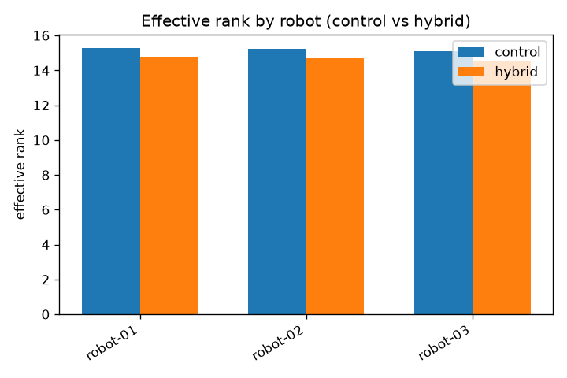
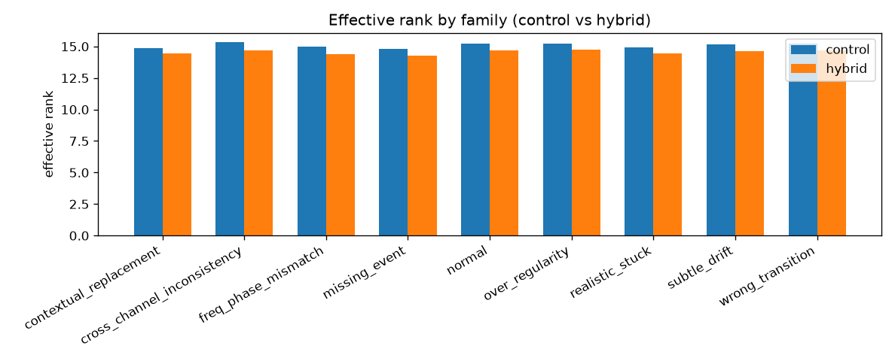
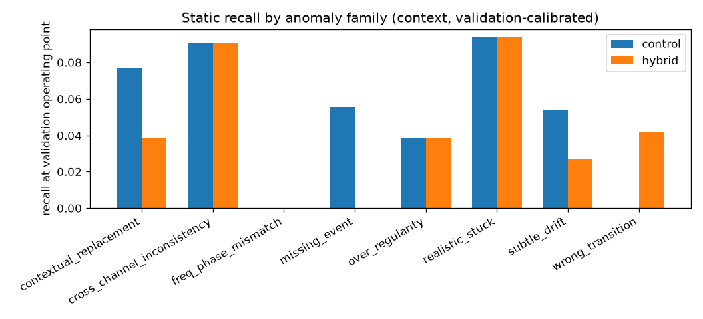
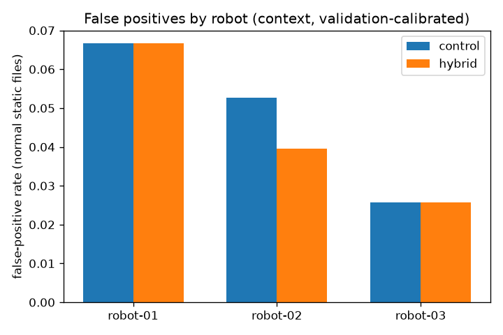
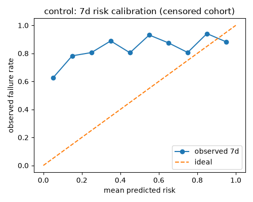
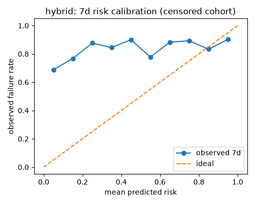
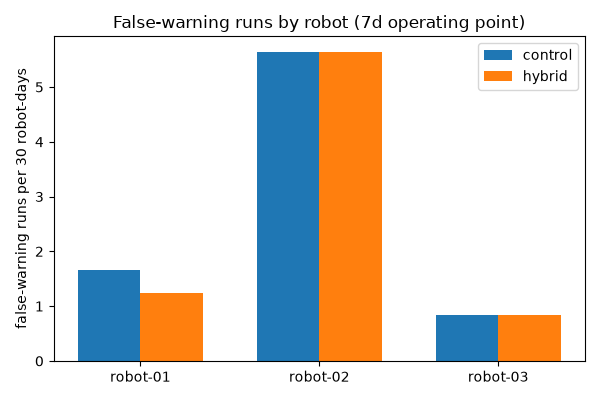

# Sprint 11 results — Chronological Factory Geometry and Early-Warning Validation (all real executions)

Consolidated final report for Sprint 11 (Tasks 1–36 evidence consolidated by
Task 37, Batch A1–F2 gates). No model was trained, re-run, or re-analyzed
for this summary; every number below cites its exact accepted task artifact
(`artifacts/sprint-11/task-<N>.md`) and the Batch F3 evidence gate plus the
sprint-wide deep review remain before sprint completion. Training, analysis,
and plan commits are recorded separately and never conflated (see §2).

**Corrected-evidence basis (read first):** all results below run on the
corrected checkpoints/data at training commit `e378626` with the corrected
analysis sources `e725250` (Batch F1) and `3eef3d2` (Batch F2). Prior
`1f88da0` / `0c89be8` / `e669e2a` numbers are SUPERSEDED wherever they differ
and are never reused. The honest verdict is unchanged — **0/4 gates pass**
(G1 FAIL/FAIL, G2 UNAVAILABLE, G3 FAIL/FAIL, G4 FAIL/FAIL) — but several
corrected measures differ materially from the superseded record (notably 7d
temporal discrimination now sits modestly above chance while calibration and
1d warning still fail).

Layout mapping:

- `assets/` — the only bounded representative figures committed for this
  report (7 PNGs, ~252 KB, sha256-verified byte-identical to the ignored review
  copies; task34 views are the context-chain detection views, population
  views live in the ignored mirrors by digest).
- Review-sized JSON/CSV aggregates, executed notebooks, logs, manifests, and
  run scripts live **only** in the ignored local mirrors
  `../../artifacts/sprint-11/batch-D|E1-corrected|E2-corrected|E3-corrected|F1-corrected-v2|F2-corrected/`
  (never committed; digests verified against server copies on transfer;
  superseded `batch-E1|E2|E3|F1|F2/` dirs remain as the superseded record).
- Checkpoints, references, datasets, embeddings, row-level scores, and bulk
  traces remain **server-only** at the recorded paths (§3); they were never
  transferred and are not committed.

## Contents

- `assets/task33_effrank_robot.png`, `assets/task33_effrank_family.png` —
  geometry effective-rank bars (corrected Batch F1).
- `assets/task34_recall_by_family.png`,
  `assets/task34_fp_by_robot.png` — static context-chain family recall /
  false-positive slices (corrected Batch F1; population-view counterparts in
  the ignored mirror by digest).
- `assets/task35_calibration_7d_control.png`,
  `assets/task35_calibration_7d_hybrid.png`,
  `assets/task35_false_alerts_by_robot.png` — 7-day calibration and
  false-alert slices (corrected Batch F2).

## 1. Goal and methodology

Sprint 11 replaces independently timestamped synthetic files and the near-chance V1
geometry with (i) a deterministic 3–6 month shared-unit factory simulation with
causal scheduling and robot health, (ii) a robot-program-conditioned V2 latent
geometry with localized synthetic boundary learning, and (iii) server-verified
static detection plus one-day/seven-day early-warning evidence.
Methodology: `../../docs/LATENT_GEOMETRY_METHODOLOGY.md` (normal-manifold core
plus localized synthetic boundary learning; regularized hierarchical Mahalanobis
geometry; canonical `context_energy` acute signal kept separate from the
hierarchical `population_energy` view; empirical/conformal confidence kept
separate from the censored survival/risk layer; dev-val-only threshold and
calibrator fits with distinct provenance). Sprint plan:
`../../docs/sprint-plans/sprint-11.md`.
The predeclared Sprint 11 hypothesis is tested by four gates G1–G4 (§9); the
integrated verdict is **0/4 pass** (G1 FAIL/FAIL, G2 UNAVAILABLE, G3 FAIL/FAIL,
G4 FAIL/FAIL), an honest, reproducible negative result (§9–§11).

## 2. Commit provenance (training vs analysis vs plan kept distinct)

| role | commit | scope |
|---|---|---|
| client build (Tasks 1–23 source/docs/tests/notebooks/configs) | `a2fb8f9` | `src/synth/{chronicle,health,scheduled,scheduler,splits,temporal}.py`, 12 `src/representation/v2_*.py`, 4 canonical notebooks, `experiments/v2_staged/*.yaml`, 21 focused test files, methodology + sprint plan (`task-24.md`) |
| dataset/audit fix (arrival jitter) | `d31d172` | `src/synth/config.py`, `scheduler.py`, `chronicle.py`, scheduler tests, methodology §20.3; **execution commit for Tasks 25–26** (`task-24.md`, `task-26.md`) |
| Findings 1–3 deep-fix (B1/B2/C1/C2 contracts) | `6aebdd4` | complete signed normal density, canonical context/population separation with `energy_source`, final-alpha stationary selection, dev-val-only threshold + conformal fit with distinct provenance (`task-27.md`) |
| 2-epoch corrected contracts | `63703b3` | reviewed deep-fix + Task-27 status; **execution commit for Task 27** (`task-27.md`; prior `69ed4d5` result SUPERSEDED) |
| 5-epoch corrected matrix | `c859b7f` | reopen Tasks 28–29; **execution commit for Task 28** (`task-28.md`; prior `86812d3` result SUPERSEDED) |
| corrected selection freeze | `e9af3a2` | freeze corrected Task 29 winner balance-a (`boundary_alpha_max` 0.5, warmup 50 + ramp 100); `full_hybrid.yaml` sha256 `5ddffccf…` (`task-29.md`, `task-31.md`) |
| 50-epoch corrected full runs | `e378626` | mark Tasks 28–29 corrected/done (prior `86812d3` selection SUPERSEDED); **frozen training commit for Tasks 30–32** (`task-29.md`, `task-30.md`, `task-31.md`, `task-32.md`; prior `1f88da0` checkpoints SUPERSEDED) |
| Batch F1 corrected analysis (geometry + static) | `e725250` | softmax top-tail mass for signed energies; population elevated excluded from detection claims (`task-33.md`, `task-34.md`; prior `0c89be8` and first-corrected `2fa049b` results SUPERSEDED) |
| Batch F2 corrected analysis (early warning) | `3eef3d2` | canonical context/population signals, restored dev-val threshold/calibrator with distinct provenance, independent held-out healthy coverage (`task-35.md`; prior `e669e2a` result SUPERSEDED) |
| plan closeouts | `a832bbc` (Batch D), `dc0e410`/`63703b3` (Task 27), `c859b7f`/`e378626` (Tasks 28–29), `c2a16cb` (Tasks 30–32), `ad6b33c`/`92f909f` (Tasks 33–34), `e14127e` (Tasks 35–36; Task 37 reopened pending) | docs-only task-status updates, each after its evidence |

Local == remote (`git rev-parse HEAD` equal both sides) was verified before every
server run; remote pulls were fast-forward only; unrelated remote work (two
pre-existing untracked experiment dirs) was preserved and never touched
(`task-24.md`, `task-30.md`).

Reference/config/data hashes:

- Dataset manifest sha256
  `cf788f92d1b5947d40cb40c03bc7fb05676b7a304adacb0dc1bfb29e7c0e7135`,
  `config_hash ece4183ef68a` (Tasks 25–36, every corrected run manifest).
- Control checkpoint sha256
  `8bdb845b17a788ad39101e0f98c0654edb55727f0eec540ca44046b63dba2b7c`
  (985 097 B); hybrid checkpoint sha256
  `76be843b0a5fa94c8cdd646e2734c804498f9c38088ed71c3f16f9aa97e2cc94`
  (985 097 B) (corrected Tasks 30–32, F1/F2 run manifests; prior
  `f91030ec…`/`83d94b9d…` 984 841 B checkpoints SUPERSEDED and never read by
  any corrected run).
- `experiments/v2_staged/full_control.yaml` sha256
  `1a9f8e0ec74690f0f1d8f36cdc217ab17e3d80c5ac922efc0568a4709a7e02e4`
  (matches `task-30.md` and the committed YAML, reverified by local
  `sha256sum`; the superseded-record string `79266fd2…` applied only to the
  prior `1f88da0` config and is not reused).
- `experiments/v2_staged/full_hybrid.yaml` sha256
  `5ddffccf943287bb9d4e3a26ea2399b9ae3981d53bf4942ff0a4db24f09490d8`
  (`task-29.md`, `task-31.md`, local `sha256sum`). A superseded first freeze
  `cdf73751…` (coefficients only, inherited warmup 500 + ramp 2000 that would
  hold alpha at 0 over the ~300-step run) was caught by re-gate and
  correctively frozen; it never ran (`task-29.md`). The superseded-record
  `0dafe893…` freeze (balance-b, alpha_max 1.0) never ran a corrected full
  stage either.

## 3. Server roots (server-only; never transferred, never committed)

Remote host `trietlm@192.168.30.244`, repo
`/home/trietlm/anomaly-representation-learning`, GPU
`NVIDIA GeForce RTX 4060 Ti`, torch 2.14.0+cu130, seed 0 throughout
(`task-24.md`, corrected Tasks 27–32):

- Dataset: `data/generated/sprint11-server/` — `files/shard-00000.zip`
  (`ddad869b…`), `files/shard-00001.zip` (`b0a024b9…`), 11 MB total
  (`task-25.md`, `task-26.md`).
- Control training (corrected):
  `/tmp/sprint11-task30-corrected-control/full/control-normal-only/default/`
  (`v2_checkpoint.pt` + `provenance.json` + `full/matrix_summary.json`).
- Hybrid training (corrected):
  `/tmp/sprint11-task31-corrected-hybrid/full/hybrid-boundary/default/`
  (same layout).
- 5-epoch matrix (corrected): `/tmp/sprint11-task28-corrected-balance/`
  (per-cell checkpoints + provenances).
- 2-epoch contracts (corrected): `/tmp/sprint11-task27-corrected/`.
- Extraction (corrected): `/tmp/sprint11-task32-corrected-extract/`
  (`infer-{control,hybrid}/`, `traj-{control,hybrid}/`: executed notebooks,
  metrics, provenances, figures).
- Analysis reruns (corrected): `/tmp/sprint11-task3334-f1-corrected-v2/`
  (+ `-rerun`, byte-identical), `/tmp/sprint11-task3536-f2-corrected/`
  (+ `-rerun`, byte-identical).
- In-memory-only artifacts (never persisted to disk anywhere): patch embeddings
  and row-level score tensors (`task-32.md`, `task-33.md`, `task-35.md`).

## 4. Generated calendar, data, and split counts (Tasks 25–26)

Locked server profile at `d31d172` via the public entry point
(`python -m synth.cli --chronological --profile server`, seed 0): 3 robots over
routes-A/B line topology, 300 units, 6 h mean arrival spacing with one-slot
deterministic arrival jitter (21600 s; the jitter fix for zero cross-robot
overlap is recorded in `task-26.md`, superseded grid-locked manifest `0f363ea0…`
overwritten in place, never consumed), 90-day calendar, 45-day cutoff, 7-day
precursor quarantine (`task-25.md`). The dataset was generated once and reused
unchanged by every corrected rerun (manifest `cf788f92…` re-verified pre-run
each time).

Persisted counts (manifest `cf788f92…`; audit 49/49 PASS through the public
reader, `task-26.md`): **600 files — 381 normal / 219 abnormal; dev-train 44,
dev-val 11, static test 364, temporal view 523, quarantined 470**
(`precursor_horizon` 389, `failure_event` 23, `maintenance_transition` 58);
episodes — degradation 24, failure 23, maintenance 23; precursors —
`failure_within_1d` 82 files, `failure_within_7d` 423 files.
Split discipline verified: dev (55) all NORMAL, pre-cutoff, quarantine-free;
dev∩static, dev∩temporal, train∩val all empty; train/val is the chronological
80/20 split of verified-healthy pre-cutoff files; static holds every abnormal
from any time plus every post-cutoff normal; temporal view exactly
chronological (`task-26.md`).
Audit also verified: no same-robot overlap, 36 cross-robot async overlapping
pairs, causal route chaining (demo `unit-0000`: route-B
`robot-02/program-03 → robot-03/program-01`), health `G == γH` on 600/600 files
with program-sensitive manifestation, failure/maintenance causality, 600/600
`encoder_inputs()` leakage-free, and 600/600 decoded byte-exact determinism
(`task-26.md`).
Client smoke (Task 23, tiny profile, ignored
`artifacts/sprint-11/task-23-smoke/`): 120 files (28 dev-train / 7 dev-val /
73 static / 83 temporal / 43 quarantined); found and fixed 3 notebook defects
before any server work; 2-epoch smoke AUROC 0.33 correctly claimed as
untrained-geometry artifact, never as quality evidence (`task-23.md`).

## 5. Staged execution: 2-epoch contracts, 5-epoch balance, 50-epoch full runs (all CORRECTED)

All corrected stages ran the Findings 1–3 runner with the complete signed
objective, canonical context/population separation, final-alpha stationary
selection, dev-val-only threshold + conformal fit with distinct provenance,
chronological dev views, and sealed test views asserted disjoint and never
scored or fitted (`task-27.md`, `task-28.md`).

- **Task 27 — 2-epoch corrected contracts** at `63703b3` (exit 0, stage wall
  3.27 s, peak CUDA 34.6 MB): both cells carry every raw/weighted term every
  epoch (loss 17.08→3.66, density 16.35→2.85, variance 0.647→0.755,
  covariance 0.00123→0.00019, background 0.087→0.054; grad norms 1.0/1.0);
  canonical separation (`context_energy` mean −1.836 vs `population_energy`
  mean −32.61, `context_population_distinct: true`); final-alpha stationary
  0.7750 vs 1.7745; dev-val threshold 4.1180 (context_energy, n=330) and
  dev-val-only calibrator (n=11, small-sample) restored by default; geometry
  32 references, median cond 31.19 / worst 145.18; bit-identical restore;
  alpha 0.0 both epochs both cells (expected contract-schedule coincidence:
  warmup 500 exceeds the 12-step run). Two driver-side defects (stale
  `patch_energy` key, deleted import) fixed with both failed runs discarded;
  corrected source needed no fix (`task-27.md`).
- **Task 28 — 5-epoch corrected coefficient matrix** at `c859b7f` (4/4 exit
  0, stage wall 7.47 s): stage-specific schedule warmup 5 + ramp 10 (alpha
  max at step 15, nonzero 24 of 30 steps); every epoch row carries the
  complete signed objective, all finite in all 20 rows:

  | cell | variant | α_max → final α | best stationary (val final) | worst cond | eff. rank / aniso | gap@2.0 | monotone | bg leak / scale |
  |---|---|---|---|---|---|---|---|---|
  | balance-a | hybrid | 0.5 → 0.5 | −18.343 (−18.343) | 36.6 | 8.85 / 8.23 | +0.00097 | yes | 7.8e-9 / 0.9648 |
  | balance-b | hybrid | 1.0 → 1.0 | −17.530 (−17.530) | 38.1 | 8.86 / 8.22 | +0.00074 | yes | 8.2e-9 / 0.9634 |
  | balance-c | hybrid | 1.0 → 1.0 | −17.526 (−17.526) | 38.3 | 8.86 / 8.22 | +0.00075 | yes | 8.2e-9 / 0.9635 |
  | balance-control | control | 0.0 → 0.0 | −18.958 (−18.958) | 36.0 | 8.84 / 8.26 | +0.00110 | yes | 7.7e-9 / 0.9657 |

  Dev-val thresholds (context_energy q95, n=330): −11.784/−11.471/−11.461/
  −11.888, restored by default; dev-val-only calibrators (n=11,
  small-sample), no pooled fallback. Honest limitation recorded: the control
  probe gap (+0.00110) exceeds the hybrid gaps — at 5-epoch scale the probe
  does not isolate boundary training, and no post-hoc gate was added
  (`task-28.md`; selection in `task-29.md`).
- **Task 29 — corrected coefficient selection gate** (mechanical, predeclared
  `apply_balance_selection`, test views never opened): **balance-a WINS**
  (passed all of finite / schedule-active / geometry / no-collapse /
  separation / ordering / localization; ranked first on gap/leak/stationary);
  balance-b and balance-c passed all gates but ranked below; control is a
  valid reference. All gaps are honestly small (~1e-3, not a detection
  claim); the record would have failed honestly (`insufficient_evidence`)
  had none passed. Full-run config frozen complete with checksum before
  Tasks 30+ (`full_hybrid.yaml` `5ddffccf…`, alpha_max 0.5, warmup 50 +
  ramp 100, max at step 150; `task-29.md`).
- **Task 30 — 50-epoch corrected normal-only control** at `e378626`
  (exit 0, shared 19.43 s stage wall, 34.6 MB peak CUDA): alpha held 0.0 all
  50 epochs; stationary-best **−86.293** (complete signed-likelihood
  validation objective at the final coefficient; val-final identical, best at
  the final epoch); full per-epoch history saved (all finite, all 50 rows);
  checkpoint `8bdb845b…` (985 097 B), bit-identical restore, frozen
  dev-train hierarchy (worst cond 3.91, all finite); probes rank 7.78/32,
  anisotropy 8.56; context severity gap@2.0 +0.00129, monotone (verbatim —
  comparison belongs to Tasks 33+); dev-val-only threshold (−86.24,
  context_energy, n=330) and conformal calibrator (dev-val, n=11,
  small-sample) with distinct provenance (`task-30.md`).
- **Task 31 — 50-epoch corrected hybrid boundary** at `e378626`, identical
  commit/data/seed/compute contract (exit 0): alpha 0.0 epochs 1–8, first
  nonzero epoch 9 (steps cross warmup 50), saturated 0.5 from epoch 26
  (step 156 ≥ max_step 150) through epoch 50 — 42 active epochs, 25
  saturated (driver-asserted); stationary-best **−81.547** at the final
  epoch; checkpoint `76be843b…` (985 097 B), bit-identical restore, frozen
  hierarchy (worst cond 4.15); probes rank 8.08/32, anisotropy 8.04; context
  severity gap@2.0 +0.00061, monotone (verbatim). No outcome-driven retuning
  (`task-31.md`).
- **Task 32 — corrected bounded extraction** at `e378626` (4/4
  `nbconvert --execute` exit 0, 0 failures): canonical `infer_v2_static` +
  `trajectory_v2_early_warning` against both corrected checkpoints with
  restored-checkpoint references (never refit), dev-val-only /
  allowed-fit-only calibration; only digest-verified review-sized notebooks,
  logs, manifests, metrics, summaries, and figures transferred (ignored
  `artifacts/sprint-11/batch-E3-corrected/`, 782 KB, 29/29 sha256 match, 0
  mismatches); no interpretation made at extraction — values carried
  verbatim for Tasks 33+ (`task-32.md`).

## 6. Control vs hybrid geometry (Task 33, corrected analysis `e725250`, training `e378626` frozen)

Pool: 12 964 valid patches per variant (identical masks/counts); temporal view
untouched; row-level latents/scores/masks stayed in server memory; canonical
context/population signals with explicit `energy_source` at every seam
(`../../artifacts/sprint-11/task-33.md`; aggregates in ignored
`artifacts/sprint-11/batch-F1-corrected-v2/task33_geometry.json`
`bf61b94c…`, `task33_slices.csv` `eac04a06…`, `run_manifest.json`
`64ee654d…`; first-corrected `2fa049b` masses SUPERSEDED as vacuous):

| measure | control | hybrid | Δ (hybrid − control) |
|---|---|---|---|
| effective rank (d=32) | 15.27 | 14.74 | −0.53 (per-robot uniform, no outlier) |
| anisotropy (smax/smin) | 4.26e5 | 5.05e5 | +7.9e4 (two orders below the superseded ~2e7; boundary training did not remove it) |
| covariance cond median / worst (frozen, float64, all levels) | 1.5 / 3.9 | 1.8 / 4.1 | +0.25 / +0.24; all finite and well-conditioned (superseded near-singular worst 5418/4574 eliminated) |
| mixture/fallback coverage | 84.8% finest / 15.2% pair / 0% robot/fleet | identical | — (same dev-fitted hierarchy) |
| within/between ratios (robot / pair / regime / label) | 0.972 / 0.982 / 1.095 / 0.994 | 0.970 / 0.978 / 1.083 / 0.994 | ≈1.0 throughout — no conditional clustering |
| clean/corrupt ordering, context (64 files, 193 patches) | 0.503, gap +0.0002 | 0.523, gap +0.0016 | no systematic outward movement on the boundary-trained signal |
| clean/corrupt ordering, population | 0.492, gap +0.0013 | 0.523, gap +0.0017 | same (background MSE stable) |
| sparse-evidence tail-hit, context (dev p95 diagnostic) | 36/219 (0.164) | 61/219 (0.279) | +0.115 (mean-hit 0.224→0.192) |
| sparse-evidence tail-hit, population | 0.178 | 0.192 | +0.014 (mean-hit 0.315→0.361) |
| tail medians abnormal vs normal, context | −86.68 vs −86.57 | −82.52 vs −82.46 | coincide (softmax masses likewise coincide) |
| tail medians abnormal vs normal, population | −67.62 vs −67.61 | −66.63 vs −66.59 | coincide |
| severity tail means low(<0.5, n=27) / mid[0.5,1.0) (no high files), context | −85.86 / −86.05 | −82.00 / −82.20 | lower-severity bins carry *higher* energy — no monotone ordering |
| severity tail means, population | −66.52 / −67.26 | −65.50 / −66.32 | same inversion |
| trajectory continuity (successive/random, 3 robots), context | 1.007 / 0.995 / 0.974 | 0.950 / 0.985 / 0.988 | successive steps indistinguishable from random pairs |
| trajectory continuity, population | 0.938 / 0.980 / 0.983 | 0.990 / 0.966 / 1.000 | same |

Rerun to a second output root produced byte-identical
`task33_geometry.json`/`task33_slices.csv`/`task34_static.json`/
`task34_slices.csv`/`run_manifest.json`; 14 focused tests green
(`task-33.md`). Effective rank, anisotropy, and conditioning are reported
strictly as representation health — never equated with separation (§9 G1).
The held-out-family gate is UNAVAILABLE (family-agnostic synthesis; all eight
test families equally unseen — every family slice is known-family
description, never held-out evidence).

## 7. Static detection and localization (Task 34, corrected, sealed 364-file static test)

Restored references and restored dev-val operating threshold
(`context_energy` healthy-validation-quantile q95, n=330 patches: control
−86.240, hybrid −82.058) recorded separately from the dev-val-only conformal
calibrator (n=11 files, small_sample=true); confidence decision point
recomputed at the 95th percentile of dev-val confidences only (n=11,
threshold exactly 0.8750 both variants — fragile by construction, carried as
provenance, never folded into a single ambiguous claim). Context-chain
confusion/AUROC/AUPRC/threshold reproduce the independent Task 32 extraction
exactly; population-view tail/mean/confusion are new independent-view
diagnostics with elevated metrics excluded by construction
(`../../artifacts/sprint-11/task-34.md`; ignored
`batch-F1-corrected-v2/task34_static.json` `858ee08a…`,
`task34_slices.csv` `828108ff…`):

| metric (control → hybrid; Δ = hybrid − control) | control | hybrid | Δ |
|---|---|---|---|
| AUROC (confidence, restored calibrator) | 0.4918 | 0.4810 | −0.0109 |
| AUPRC (confidence) | 0.6026 | 0.5984 | −0.0042 |
| AUROC (context tail_energy) | 0.4758 | 0.4805 | +0.0047 |
| AUPRC (context tail) | 0.5901 | 0.5828 | −0.0074 |
| AUROC (population tail_energy) | 0.4777 | 0.4706 | −0.0071 |
| AUPRC (population tail) | 0.5948 | 0.5914 | −0.0034 |
| tp / fp / fn / tn (confidence) | 12 / 7 / 207 / 138 | 10 / 6 / 209 / 139 | −2 / −1 / +2 / +1 |
| precision / recall (confidence) | 0.6316 / 0.0548 | 0.6250 / 0.0457 | — |
| F1 @ validation point (population view, diagnostic) | 0.3061 | 0.3278 | +0.0216 (more calls at more false positives; AUROC still below chance — no substitution claimed) |
| tp / fp / fn / tn (population) | 45 / 30 / 174 / 115 | 49 / 31 / 170 / 114 | +4 / +1 / −4 / −1 |

- **Conformal confidence does not separate:** median confidence abnormal vs
  normal 0.500 vs 0.500 (control); 0.583 vs 0.583 (hybrid). Matched per-file
  confidence deltas mean −0.006 (median 0.000, std 0.093).
- **Elevated fractions:** context elevated medians are 0.000 for both classes
  under both variants — legitimate output of the restored patch-level cutoff
  (it sits above nearly all context patch energies), carrying no class
  information (context elevated AUROC 0.4900 / 0.4729, retained for
  completeness). Population elevated fractions are EXCLUDED from all
  detection claims (`elevated_fraction_excluded`): the restored threshold is
  calibrated on `context_energy` and uncalibrated cross-signal.
- **False positives (normal static files, n=145):** context by robot —
  control (2/30, 4/76, 1/39), hybrid (2/30, 3/76, 1/39); by program —
  control (3/69, 1/30, 3/46), hybrid (3/69, 0/30, 3/46); worst pair
  robot-02/program-03 3/46 both; worst regime periodic 4/69 both. Population
  FP is heavier everywhere: control 30 total (robot-02 21/76, program-02
  11/30, pair 11/30) → hybrid 31 total (22/76, 12/30, 12/30).
- **Family recall at validation operating points (known families only, not
  held-out):** context control — contextual_replacement 2/26,
  cross_channel 3/33, freq_phase 0/23, missing_event 1/18, over_regularity
  1/26, realistic_stuck 3/32, subtle_drift 2/37, wrong_transition 0/24;
  hybrid — 1/26, 3/33, 0/23, 0/18, 1/26, 3/32, 1/37, 1/24 (hybrid ≤ control
  in 7/8: worse in 3, tied in 4, better in 1). Population control — 8/26,
  3/33, 3/23, 6/18, 4/26, 10/32, 7/37, 4/24; hybrid — 8/26, 4/33, 3/23,
  6/18, 4/26, 10/32, 8/37, 6/24. No family is detected on the context chain
  under either variant.
- **Localization (219 masked abnormal files), per energy_source:** context
  argmax-timestep hit rate 0.306 (67/219) → 0.301 (66/219); top-3 overlap
  mean 0.249 → 0.223. Population argmax 0.196 (43/219) → 0.247 (54/219);
  top-3 overlap mean 0.195 → 0.198. Softmax top-tail mass medians (abnormal
  files): context 0.2227 → 0.2132, population 0.2484 → 0.2551 —
  concentrated no more than normal files. Localization without separation on
  both signals.

## 8. Chronological early warning and calibration (Task 35, corrected analysis `3eef3d2`, untouched 523-file temporal view)

Commissioned + guarded short-term baselines (restored, never refit); suspect
guard (abnormal/quarantined files update neither baseline); survival fit on
allowed pre-cutoff non-test cohort only (**n=77, quarantined precursors
incl. n=22**, sealed views asserted disjoint); temporal risk operating point
at the 95th percentile of allowed-fit 7d negatives (55 negatives: control
0.4776, hybrid 0.5411; provenance
`operating_threshold_fit_cohort=allowed-pre-cutoff-nontest`, distinct from
the restored dev-val static threshold); canonical `context_energy` acute
chain with explicit `energy_source` plus a separately labeled
`population_energy` view (elevated excluded); row-level timelines/embeddings/
scores stayed in server memory
(`../../artifacts/sprint-11/task-35.md`; ignored
`batch-F2-corrected/task35_temporal.json` `6463b648…`,
`task35_slices.csv` `9d3a8150…`, `run_manifest.json` `d9055bd2…`).
Determinism rerun to a second output root byte-identical (3/3 files).

| metric (control → hybrid; Δ) | control | hybrid | Δ |
|---|---|---|---|
| event recall 1d (23 episodes) | 0.043 (1/23) | 0.000 (0/23) | −1 hit |
| event recall 7d | 0.826 (19/23) | 0.913 (21/23) | +2 hits |
| lead-time 7d median [p25, p75], n | 6.49 [4.95, 6.87] d, 19 | 6.51 [5.32, 6.85] d, 21 | — |
| lead-time 1d | 0.70 d (n=1) | undefined (n=0) | — |
| warning persistence mean [median], n | 0.403 [0.326], 20 | 0.379 [0.296], 21 | −0.024 |
| false-warning runs (218.6 robot-days) | 20 | 19 | −1 |
| false runs / robot-day [/ 30 robot-days] | 0.0915 [2.744] | 0.0869 [2.607] | −0.005 [−0.137] |
| AUROC 1d / 7d | 0.497 / 0.618 | 0.506 / 0.602 | +0.009 / −0.016 |
| AUPRC 1d / 7d (baselines 0.163 / 0.837) | 0.161 / 0.882 | 0.165 / 0.881 | +0.003 / −0.001 (7d above prevalence; 1d at prevalence) |
| concordance C_7d (114 211 pairs) | 0.543 | 0.544 | +0.001 |
| Brier 1d / 7d (constant ref 0.136 both) | 0.163 / 0.341 | 0.157 / 0.345 | −0.006 / +0.004 (7d ≈ 2.5× reference) |
| ECE 1d / 7d | 0.118 / 0.412 | 0.110 / 0.389 | −0.008 / −0.023 |
| conformal healthy coverage, independent (n=55 held-out) | 1.0 | 1.0 | 0.000 |
| conformal coverage, fit in-sample diagnostic (n=55) | 1.0 | 1.0 | 0.000 |

- **Corrected coverage provenance (not pooled):** the restored calibrator is
  dev-val-only (n=11). Independent coverage (1.0 @ 0.95) is measured on
  normal, non-quarantined temporal files asserted disjoint from dev-val AND
  survival-fit rows. Fit-cohort coverage (1.0 @ 0.95, n=55 allowed-fit 7d
  negatives) is an in-sample diagnostic: all 11 dev-val calibrator rows sit
  inside the survival-fit cohort
  (`n_fit_overlaps_dev_val_calibrator_rows=11`), so it pools fit data and is
  never presented as independent. Coverage 1.0 exceeds nominal 0.95 on n=55
  — conservative small-sample observation, not calibration skill.
- 7d discrimination is modestly above chance (AUROC 0.62/0.60, AUPRC above
  prevalence, concordance 0.54) but risk magnitudes are uncalibrated
  (ECE_7d 0.41/0.39; Brier_7d ~2.5× reference; bins span observed 7d rates
  0.63–0.88+ against an 84% event rate). 7d recall stays
  prevalence-assisted (401/479 usable files inside a 7d window; persistence
  ~0.3–0.4); the 1d view (chance AUROC, AUPRC at prevalence, 1/23 → 0/23)
  exposes the absence of acute warning.
- Hybrid deltas are ±noise on every discrimination/calibration metric —
  threshold arithmetic on overlapping score distributions (0.541 vs 0.478),
  not representation improvement.
- Slices: known-robot 7d recall robot-01 0.83→0.83 (6 episodes), robot-02
  0.90→0.90 (10), robot-03 0.71→1.00 (7); 1d recall 0.0 except control
  robot-02 0.10 (the single 1d hit). Per-robot 7d AUROC 0.74/0.56/0.47 →
  0.70/0.53/0.46; every per-robot Brier exceeds its constant reference;
  false runs concentrate on robot-02 (14 of 20 / 14 of 19). Program
  sensitivity — warned fraction inside 7d windows program-01 0.184→0.161
  (n=174), program-02 0.894→0.865 (n=104), program-03 0.187→0.325 (n=123);
  per-program 7d AUROC 0.56–0.69 throughout. Population view: tail medians
  abnormal vs normal −67.62 vs −67.57 → −66.63 vs −66.55 (coincident,
  abnormal below normal). Censoring: 523 = 479 observed + 44 censored (all
  NaN-time; per-horizon excluded 44; usable 479 with 78/401 events).
- Maintenance handling is mechanically correct (58 scored breaks, no
  bridging, suspect guard) but maintenance *contrast* is unmeasurable: the
  predeclared ±3d window saturates (all 523 files within 3 days of 23
  episodes), so within-window displacement trivially equals the overall
  median (control 0.00230, hybrid 0.00291) and warned fractions
  (0.342/0.367) carry no contrast.

## 9. Hypothesis gates and integrated verdict (Task 36, corrected F1+F2 evidence)

Gates restate methodology §7/§17 and sprint acceptance criteria as conventional
effectiveness bars — not fit to the numbers, no threshold moved after opening
any test view. The single close leg (7d AUROC vs 0.6) is reported with its
exact margin, not rounded into a pass
(`../../artifacts/sprint-11/task-36.md`):

| gate | bar | control | hybrid | verdict |
|---|---|---|---|---|
| G1 geometry separates normal/abnormal | AUROC > 0.6, abnormal energies above normal medians | 0.4918; medians coincide (conf 0.500/0.500; tail −86.68 vs −86.57) | 0.4810; medians coincide (0.583/0.583; −82.52 vs −82.46) | **FAIL / FAIL** |
| G2 boundary improves held-out families | held-out recall Δ > 0 | gate UNAVAILABLE (family-agnostic synthesis; proxy: hybrid ≤ control 7/8 — worse 3, tied 4, better 1) | same | **UNAVAILABLE** |
| G3 aggregation preserves sparse/local evidence | tail-hit clearly above normal + monotone severity | argmax 0.306, top-3 0.249; tail-hit 0.164; lower-severity bins higher energy | argmax 0.301, top-3 0.223; tail-hit 0.279; same inversion | **FAIL / FAIL** (aggregation exonerated — patch energies themselves do not separate) |
| G4 trajectories give calibrated warning | 7d AUROC > 0.6 AND ECE_7d < 0.15 AND Brier_7d < 0.136 AND 1d recall > 0.5 | 0.618 / 0.412 / 0.341 / 0.043 | 0.602 / 0.389 / 0.345 / 0.000 | **FAIL / FAIL** (AUROC leg passes narrowly; ECE, Brier, 1d-recall legs fail decisively both variants) |

**Integrated verdict: 0 of 4 gates pass.** The hybrid matches the control on
nearly every corrected measure (1d recall 1/23→0/23, 7d 19/23→21/23
prevalence-assisted; localization flat at 0.306→0.301). No gate is rescued by
threshold choice: static discrimination is at/below chance and temporal risk
is miscalibrated with no 1d signal, so no operating point separates the
classes early and calibratedly, and **no threshold retuning was attempted or
is proposed**.

Root causes R1–R5 (`task-36.md`): **R1** real families map inside the frozen
normal references (primary; the exact failure mode methodology §3 warns
normal-only training permits; context probe 0.50/0.52 — the boundary
objective barely separates its own synthetic distribution while leaving real
anomalies inside the manifold; corrected severity means rule out a
severity-gradient rescue); **R2** the survival layer has weak ranking signal
and no calibration, with prevalence assisting 7d recall (7d AUROC 0.62/0.60,
concordance 0.54, but ECE_7d ~0.40, Brier ~2.5× reference, 1d AUPRC at
prevalence); **R3** program-02 warning concentration (0.89/0.87 vs 0.16–0.33;
data/model ambiguity, recorded not assigned — the superseded run's
program-01 blind spot does not reproduce on corrected checkpoints, stated
not hidden); **R4** structural evaluation gaps (no cold-start units, no
held-out families, fragile n=11 static point with decision threshold exactly
0.8750 both variants, saturated maintenance window); **R5** calibration
failure is consequence, not cause — representation failure cannot be tuned
around.

## 10. Availability ledger (what exists vs what is unavailable — no substitution)

- **Known-robot evidence: EXISTS.** All 3 temporal robots appear in dev views;
  known-robot slices are the only robot evidence (7d recall 0.71–1.00 with
  per-robot 7d AUROC 0.46–0.74 and every per-robot Brier above its constant
  reference — recall without calibration, §8).
- **Genuine cold-start (held-out robot/program): UNAVAILABLE.** All 3 robots
  and all 3 programs appear in dev views (`cold_start_robots=[]`,
  `cold_start_programs=[]`); no learning-curve / cold-start evidence exists in
  this materialization. Stated, not proxied (`task-35.md`, `task-36.md`).
- **Genuine held-out-family: UNAVAILABLE.** Training synthesis is
  family-agnostic random patch perturbation and never reserves a family; all
  eight test families are equally unseen by both variants. Every family slice
  is known-family description, never held-out evidence — the critical
  all-unseen-versus-held-out distinction (`task-33.md`, `task-34.md`,
  `task-36.md`).
- **Operational vs scientific status kept distinct:** operational SUCCESS (all
  corrected runs exit 0 at verified commits; provenance exact; F1 aggregates
  byte-identical across reruns; F2 JSON/CSV/manifest byte-identical across
  reruns; F1 context chain reproduces the Task 32 extraction exactly) vs
  scientific NEGATIVE (the implemented normal-manifold-plus-boundary design,
  as selected through the frozen staged gate, does not separate statically,
  does not warn calibratedly, and does not improve with boundary training)
  (`task-36.md`).

## 11. Limitations (negative results not softened)

Single seed 0; one server-scale materialization; dev-train references from 44
files; allowed survival fit n=77; independent conformal coverage n=55;
static operating point and confidence decision on fragile n=11 dev-val
(decision threshold exactly 0.8750 both variants) with small-sample
calibrator; 600-file / 44-train scale; 3 robots / 3 programs (program/robot
coverage limits); anisotropy 4.26e5/5.05e5 both variants (spread retained,
two orders below the superseded ~2e7); coincident abnormal/normal energies
across confidence/context/population signals; ±3d maintenance-contrast window
saturated; unavailable genuine held-out-family and cold-start gates (§10). The
negative verdict is strong within these bounds (static effects at/below
chance; temporal calibration/1d legs fail decisively) but does not generalize
beyond them. Any redesign is outside Sprint 11: this report records, it does
not redesign.

## 12. Evidence-review standing and closeout state

- Batches A1–F2 each passed a fresh `evidence-reviewer` PASS with zero
  actionable findings, most recently Batch F2-corrected (verdict PASS:
  exact provenance at `3eef3d2`/`e378626`, F2 rerun byte-identical,
  independent vs in-sample coverage provenance, no reused superseded
  numbers).
- Task 37 is complete **for its F3 evidence gate only**. Sprint status remains
  **Active**; the Batch F3 evidence review of this report and the sprint-wide
  differential deep review are still required before any completion claim,
  and `docs/PLAN.md` keeps Sprint 11 active accordingly.
